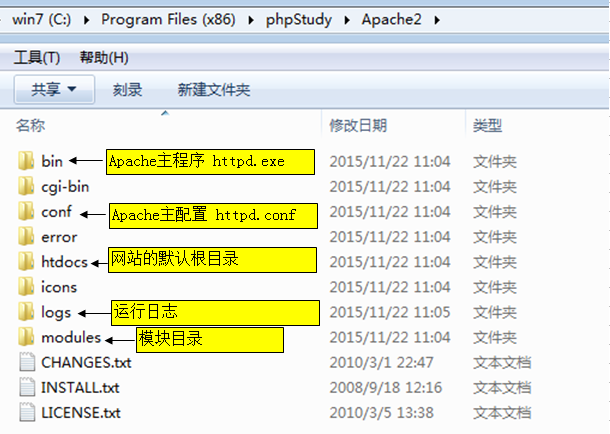

## 网络基础apache配置
### IP
192.168.4.234 (点分十进制法)        
IP地址由四段，每段8位二进制组成。每一段的取值范围：0-255      
计算机的语言，就是二进制语言。如：1101010100101010101001 

127.0.0.1             
功能：用于本机的软件测试或网站测试。     
注意：只能自己访问自己，外部的IP不能访问你的127.0.0.1      
   
nslook   domain  可以查看域名对应的地址   
一个主机可以有多个网卡，每个网卡可以多个设置     

### 域名  
 1. 字母、数字、中划线            
 2. 分类： 
    *  .com  商业公司
    * .edu 
    *  .org  非盈利组织  
    *  .mil军队
    *  .net  网络公司
    *  .cn 
    *  .kp
### DNS  

host 本地的DNS  
远程的DNS是个服务器，运营商用的

### apache
#### 目录结构  


#### httpd.exe apache的主程序  
C:\xampp\apache\bin  

####  httpd.conf   
apache 主配置路径  \Apache2\conf\httpd.conf   
1.  DocumentRoot "/xampp/htdocs"  设置网站的根目录     DocumentRoot "d:/workspace/php"

2. DirectoryIndex   指定访问域名没有带路径的时候应该优先打开哪些文件作为主页，越靠前越先执行，米有找到的话，就会显示目录列表  
```xml
<IfModule dir_module>
    DirectoryIndex index.php index.pl index.cgi index.asp index.shtml index.html index.htm \
                   default.php default.pl default.cgi default.asp default.shtml default.html default.htm \
                   home.php home.pl home.cgi home.asp home.shtml home.html home.htm
</IfModule>
```
3. listen

描述：当Apache启动后，会等待请求的进入。会监听本机上指定IP地址和端口的问。   
* 语法：Listen [IP][:端口号]
* 举例：
     * Listen 80    //监听本机的所有IP地址的80端口的请求
     * Listen 192.168.3.100   //监听本机的指定IP地址192.168.3.100的所有端口的访问
     * Listen 192.168.18.89:8080  //监听本机指定IP地址192.168.18.89的8080端口的访问

4. Directory 

```xml
 DocumentRoot "d:/workspace/php"
<Directory "d:/workspace/php">

    Options Indexes FollowSymLinks Includes ExecCG
    <!--# AllowOverride controls what directives may be placed in .htaccess files.-->
    <!--#   It can be "All", "None", or any combination of the keywords:-->
    <!--#   AllowOverride FileInfo AuthConfig Limit-->
    AllowOverride None
   <!--谁能访问-->
    Require all granted
</Directory>

旧版的是

<Directory />
    Options FollowSymLinks
    AllowOverride None
    Order deny,allow
    Deny from all
</Directory>
```


+ Options：首页文件不存在的时候是否显示文件的列表；指定服务器将启用哪些服务器特性。取值：none、All、Indexes
    - None：禁用启用服务器特性。
    - All：开启所有服务器特性。
    - Indexes：如果首页文件不存在，则显示目录列表。
+ Order：指定Allow(允许)和Deny(禁止)的执行顺序。允许哪些ip访问，拒绝哪些ip访问
   - Order Allow,Deny   先允许访问，再禁止IP访问    
   - Order Deny,Allow   先禁止所有访问，再开启指定IP的访问    

+ Deny：禁止哪些IP访问你的主机。
     - Deny From All  #禁止所有IP访问你的主机，包括你自己。
     - Deny From 192.168.18.76    #禁止指定IP访问你的主机。禁止客户端的IP地址，不是主机的网卡IP地址。
     - Deny From 192.168.18.87  192.168.18.74  #同时禁用两个外部IP访问你的主机
     - Deny From 192.168.18   #禁止网段介于192.168.18.0~192.168.18.255之间所有IP访问
+ Allow：允许哪些IP访问你的主机。
     - Allow From All  #允许所有IP访问你的主机，包括你自己。
     - Allow From 192.168.18.76    #允许指定IP访问你的主机。
     - Allow From 192.168.18.87  192.168.18.74  #同时允许两个外部IP访问你的主机
     - Allow From 192.168.18   #允许网段介于192.168.18.0~192.168.18.255之间所有IP访问      
#### 虚拟主机  
1. 分出一小块空间，绑定一个域名  
2. NameVirtualHost    
  配置的虚拟主机，是基于域名的虚拟主机。换句话说：一个IP地址，可以绑定多个域名情况。其实，还有一种基于IP的虚拟主机，意思：就是一个IP地址，对应一个域名 
 新版的在
  C:\xampp\apache\conf\extra\httpd-vhost.conf
3. 虚拟主机的配置过骤
+ 配置本地的DNS文件——hosts   
  文件路径：C:\Windows\System32\drivers\etc\hosts

+ 配置Apache的主配置文件——httpd.conf 
  listen 哪个端口
  监听自己网卡的哪个IP地址的，哪个端口的访问

 +  配置Apache的虚拟主机——C:\xampp\apache\conf\extra\httpd-vhost.conf
```xml
NameVirtualHost *:80

<VirtualHost *:80>
    ##ServerAdmin webmaster@dummy-host.example.com
    DocumentRoot "D:/workspace/php"
    ServerName www.beta.com
    ##ServerAlias www.dummy-host.example.com
    ##ErrorLog "logs/dummy-host.example.com-error.log"
    ##CustomLog "logs/dummy-host.example.com-access.log" common
</VirtualHost>
```


因为配置完虚拟主机后，第一个虚拟主机的优先级最高，比全局中的配置还要高。因此，访问localhost时，就指向了第一个虚拟主机。  


##PHP  

PHP超文本预处理器。是嵌入HTML文件中的服务器端脚本程序。换句话：PHP只能运行在服务器上。
一个HTML文件中，可以包含的代码：HTML代码、CSS代码、JS代码、PHP代码等。
PHP的主要功能：web应用开发(线上产品)。   
### PHP语言基础
+ PHP代码，跟ASP一样，都是嵌入到HTML文件中去的。
+ PHP代码标记：<?php …… ?>   单独的文件最好省略结尾
+ PHP文件的扩展名：.php
+ PHP文件的执行，必须经过apache等解析才行。
+ 访问PHP文件的路径上，不能包含空格和中文。
+ PHP也是区分大小写，但关键字和函数名不区分大小写。
+ PHP中每条语句，必须以英文下的分号结束(;)。
+ php 会将空格合并
#### 变量 
1. 命名

  * PHP的变量前，必须以“$”符号开头，但不是变量名的一部分。如：$name、$age
  * 对长文件名，如何命名呢？
    * “驼峰式命名”：$getUserName、$getUserPassword
    * “下划线式命名”：$get_user_name、$get_user_pwd

2. 写程序的一般思路
    * 变量初始化
    * 项目运行的过程。
    * 输出结果。
```php
<?php 
$name = "老王";
$age = 18;

$stri = "$name 的信息如下";
$stri.= "年龄"；

echo $stri;
?>
```
3. date('H:i:s j f y')
#### 数据类型    
提示：变量本身没有类型之分，变量的数据才有类型之分
* 标量数据类型：字符串型、整型、浮点型、布尔型
* 复合数据类型：数组、对象
* 特殊数据类型：资源、NULL   
4. php 变量的类型和js一样的，都是由其给定的值决定，并且以后可以随意更改
5. 可变变量   
```php
$name = "apple";
$$name = "banana";//等价于$apple = banana;
```

##### integer       32 位上  +- 2147483647     64位的   9*e18 左右  9223372036854775807
1. 要使用八进制表达，数字前必须加上 0（零）。要使用十六进制表达，数字前必须加上 0x。要使用二进制表达，数字前必须加上 0b。       
2. 最大值PHP_INT_MAX 来表示，最小值可以在 PHP 7.0.0 及以后的版本中用常量 PHP_INT_MIN   
3. 向8进制传递一个9 之后，php7以前会忽略后面的数字  ，php7 会报错         
4. 整数溢出之后就会返回一个float  2147483648; 强制转化，好像是用float的数字减去能表示的数字的和
5. 没有整除 ，想要得到整数，强制转化取整(int) (25/7)； 或者用  round(25/7)  四舍五入,但是得到的还是float类型的数据  
6. 其他类型转化成整数   强制类型转化  （int）或者（integer)    ;或者  int intval ( mixed $var [, int $base = 10 ] )   此方法传入对象会产生 E_NOTICE 错误并返回 1。   
     + FALSE  0（零），TRUE  1（壹）。 
     + 浮点数转换成整数时，将向下取整。 浮点数超出了整数范围，则结果为未定义，因为没有足够的精度给出一个确切的整数结果。在此情况下没有警告，甚至没有任何通知！  
     + NaN 和 Infinity 在转换成 integer 时，PHP 7.0.0 起，不再是 undefined 或者依赖于平台，而是都会变成零        
     +  符串没有包含 '.'，'e' 或 'E' 并且其数字值在整型的范围之内（由 PHP_INT_MAX 所定义），该字符串将被当成 integer 来取值。其它所有情况下都被作为 float 来取值。
        int强转，只支持十进制的样子，会忽略前面的0；如果以非数字开头就会返回0； 数字开头的话，截取到非数字位
     +  resource 转换成 integer 时， 结果会是 PHP 运行时为 resource 分配的唯一资源号。
     +  没有定义从其它类型转换为整型的行为。不要依赖任何现有的行为，因为它会未加通知地改变
7. ip地址存储的话 ，用数字比其他方式要快很多   
```php
<!--encode-->
 $ipArr    = explode('.',$_SERVER['REMOTE_ADDR']);
  $ip       = $ipArr[0] * 0x1000000
            + $ipArr[1] * 0x10000
            + $ipArr[2] * 0x100
            + $ipArr[3]
            ;
更酷的方法
$ipArr    = explode('.',$_SERVER['REMOTE_ADDR']);
  $ip       = $ipArr[0]<<24
            + $ipArr[1]<<16
            + $ipArr[2] <<8
            + $ipArr[3]
            ;

<!--decode-->

$ipVal = $row['client_IP'];
        $ipArr = array(0 =>
                    floor(  $ipVal               / 0x1000000) );
        $ipVint   = $ipVal-($ipArr[0]*0x1000000); // for clarity
        $ipArr[1] = ($ipVint & 0xFF0000)  >> 16;
        $ipArr[2] = ($ipVint & 0xFF00  )  >> 8;
        $ipArr[3] =  $ipVint & 0xFF;
        $ipDotted = implode('.', $ipArr);
```
8.  ord() 和 chr()   实现字符ASIIC码和数值之间转化  
9.  大数字可能会自动转化为float，并且% 运算会出错
10. dechex("2724838310"+0)  32位无符号整数表示方法？  
```php
function parse_unsigned_int($string) {
        $x = (float)$string;
        if ($x > (float)2147483647)
            $x -= (float)"4294967296";
        return (int)$x;
    }
```
11. 对象不能转化为int，也就不能进行数值符号的操作，他会优先转化成string的
##### float  (也可以是double )    
 1. 不能直接运算，浮点数不能准确的转化为二进制数，看到两个浮点数的直接算术运算，一般不准的，可以先转化为整数再运算
 2. 转化成浮点数先将值转换成整型，然后再转换成浮点。试图将对象转换为浮点数，会发出一条 E_NOTICE 错误消息。
 3. 比较相等，可以通过相差得到的数字与对应的允许最大误差比较  来实现；也可以 round($x, 2) == round($y, 2)
 4. NAN   结果代表着一个在浮点数运算中未定义或不可表述的值。任何拿此值与其它任何值（除了 TRUE）进行的松散或严格比较的结果都是 FALSE。由于 NAN 代表着任何不同值，不应拿 NAN 去和其它值进行比较，包括其自身，应该用 is_nan() 来检查。 
 5.  round($x[, int])  ; 对$x进行四舍五入，传入的int表示保留多少位小数
 6. 浮点数如果被解析成字符串的时候，由于地区的不同可能会得到不同的结果

##### string   
1. 一个字符串 string 就是由一系列的字符组成，其中每个字符等同于一个字节。这意味着 PHP 只能支持 256 的字符集，因此不支持 Unicode
   (1) 单引号     如果用单引号表示的字符串，其中可以包含的转义字符只能是  \\ 、\'    
   (2) 双引号   任何转义字符都能用
   (3) heredoc 类似于双引号；        
   ```php
   $str = <<<heredoc
   //.....               

   heredoc;
   ```

  * heredoc可以自定义名称。
  * 长字符串表示，必须放在“<<<heredoc”和 “heredoc;”之间。
  * “<<<heredoc”必须是开头的标记。
  * “heredoc;”必须是结束的标记。必须是单独一行，并且顶头写。
  * 可以直接解析PHP变量。
  * 也可以用 Heredoc 结构来初始化静态变量和类的属性和常量
  (4)nowdoc 结构可以用在任意的静态数据环境中，最典型的示例是用来初始化类的属性或常量  heredoc由''包围的形式
  2. 字符串的变量解析
   * 在双引号内，输出是变量的值。如：echo “{$name}的年龄是24岁”  
   * 在单引号内，输出的是变量的名称，而不是值。
   * 在双引号内，如果一个变量名后跟一个非空字符，则会让编译器糊涂。这种情况解决方案是：  
    **后面可以跟一个空格字符，也可以跟英文下的标点符号，可以使用大括号，将变量包起来 都会解析变量的**  
   * 由于 { 无法被转义，只有 $ 紧挨着 { 时才会被识别。可以用 {\$ 来表达 {$。

```php
echo "$namehello<br>";    //字符串直接使用的话，后面跟个非空的字符串会报错  
echo "$name hello<br>";   //可以在变量后面加个空格，但是空格会被保留
echo $name."hello<br>";   //变量在外面解析，并且用点号链接

     "$juices[0]"        //数组用 []访问      记得后面不能跟非空字符
echo "$people->robert"    //对象的属性访问的方法

echo "{$name}hello<br>";  //变量在双引号内，大括号解析
echo "${name}hello<br>";  //变量在双引号内，大括号解析,$符号提前也是可以的
// 有效，只有通过花括号语法才能正确解析带引号的键名
echo "This works: {$arr['key']}";
echo "This works too: {$obj->values[3]->name}";  复杂变量或者表达式推荐用大括号表示
//函数、方法、静态类变量和类常量只有在 PHP 5 以后才可在 {$} 中使用。然而，只有在该字符串被定义的命名空间中才可以将其值作为变量名来访问。只单一使用花括号 ({}) 无法处理从函数或方法的返回值或者类常量以及类静态变量的值。

echo '{$name}hello<br>';  //所有的单引号都是输出变量名
echo $name.'hello<br>';  //可以外部点的方法拼接

```
2.  string 的实现方式是一个由字节组成的数组再加上一个整数指明缓冲区长度，符串由什么值来组成并无限制；特别的，其值为 0（“NUL bytes”）的字节可以处于字符串任何位置。字符串会被按照该脚本文件相同的编码方式来编码

3. 处理字符串的方法  
   * 某些函数假定字符串是以单字节编码的，但并不需要将字节解释为特定的字符。例如 substr()，strpos()，strlen() 和 strcmp()。理解这些函数的另一种方法是它们作用于内存缓冲区，即按照字节和字节下标操作。
   * 某些函数被传递入了字符串的编码方式，也可能会假定默认无此信息。例如 htmlentities() 和 mbstring 扩展中的大部分函数。
   * 其它函数使用了当前区域（见 setlocale()），但是逐字节操作。例如 strcasecmp()，strtoupper() 和 ucfirst()。这意味着这些函数只能用于单字节编码，而且编码要与区域匹配。例如 strtoupper("á") 在区域设定正确并且 á 是单字节编码时会返回 "Á"。如果是用 UTF-8 编码则不会返回正确结果，其结果根据当前区域有可能返回损坏的值。
   * 最后一些函数会假定字符串是使用某特定编码的，通常是 UTF-8。intl 扩展和 PCRE（上例中仅在使用了 u 修饰符时）扩展中的大部分函数都是这样。尽管这
   是由于其特殊用途，utf8_decode() 会假定 UTF-8 编码而 utf8_encode() 会假定 ISO-8859-1 编码。
4.  可以吧string 当成字符组成的 array。函数 substr() 和 substr_replace() 可用于操作多于一个字符的情况。string 也可用花括号访问，比如 $str{42} ,也可以是$str[42] 
5. 超出字符串长度的下标写入将会拉长该字符串并以空格填充。非整数类型下标会被转换成整数。非法下标类型会产生一个 E_NOTICE 级别错误。用负数下标写入字符串时会产生一个 E_NOTICE 级别错误，用负数下标读取字符串时返回空字符串。写入时只用到了赋值字符串的第一个字符。用空字符串赋值则赋给的值是 NULL 字符。
6. PHP 的字符串在内部是字节组成的数组。因此用花括号访问或修改字符串对多字节字符集很不安全。仅应对单字节编码例如 ISO-8859-1 的字符串进行此类操作  
7. 自 PHP 5.4 起字符串下标必须为整数或可转换为整数的字符串，否则会发出警告。之前例如 "foo" 的下标会无声地转换成 0。
8. 用 [] 或 {} 访问任何其它类型（不包括数组或具有相应接口的对象实现）的变量只会无声地返回 NULL。


9. 转化  
   +  (string) 或用 strval() 函数来转变成字符串。              
      在一个需要字符串的表达式中，会自动转换为 string。比如在使用函数 echo 或 print 时，         
      在一个变量和一个 string 进行比较时，就会发生这种转换            
   +  true转化成字符串的时候是 1 ，false转化成空字符串  
   +   数字原样输出
   +  数组 array 总是转换成字符串 "Array"，想要访问的话，必须按照项来制作出字符串
   +  为了得到对象的类的名称，可以用  get_class() 函数。自 PHP 5 起，适当时可以用 __toString 方法。
   +  资源 resource 总会被转变成 "Resource id #1" 这种结构的字符串，其中的 1 是 PHP 在运行时分配给该 resource 的唯一值。不要依赖此结构，可能会有变更。要得到一个 resource 的类型，可以用函数 get_resource_type()。
   +  NULL 总是被转变成空字符串。
   +  大部分的 PHP 值可以转变成 string 来永久保存，这被称作串行化，可以用函数 serialize() 来实现。如果 PHP 引擎设定支持 WDDX，PHP 值也可被串行化为格式良好的 XML 文本
   + 使用函数 ord() 和 chr() 实现 ASCII 码和字符间的转换。

10. mail(发送内容)    
bool mail ( string $to , string $subject , string $message [, string $additional_headers [, string $additional_parameters ]] )        
   * to    发给谁 
   * subject  标题 
   * message  信息  
   * additional_headers    发送任何额外的有效的邮件头 
11. 字符串格式化   
   + trim(str)  删除字符串开始和结束的空格，即\n换行 、 \r回车   水平制表符\t  竖直制表符\x0B   字符结束符\0   空格      ； 衍生的函数 ltrim()和rtrim()  ;都放回新的字符串  
   + n12br($str)   把字符串中的"\n" 换成 br 标签；因为html忽略纯空格，所以换行需要标签来执行  
   + int printf ( string $format [, mixed $args [, mixed $... ]] ) 格式化的字符串输出到浏览器 
   + string sprintf ( string $format [, mixed $args [, mixed $... ]] )函数返回一个格式化的字符串  
```php
// 上面的format规则是
printf("this is %s",$a);
%s 字符串  
%.2f 保留两位小数的浮点
b 二进制    c 字符      d数字   f双精度小数  o 八进制   s字符串   u整数并作为非小数输出   
%2\$.2f 用传入的第二个参数替换  2\$来指定         

%[`padd]
```
  + int vprintf ( string $format , array $args )接收的是数组
  + string vsprintf ( string $format , array $args )
  + int fprintf ( resource $handle , string $format [, mixed $args [, mixed $... ]] ) 
  + int vfprintf ( resource $handle , string $format , array $args )


  + strtoupper() 转化成大写
  + strtolower()
  + ucfirst() 首字母大写
  + ucwords() 字符串每个单词的首字母大写 
15. 格式化字符串用于存储  
  + 引号 反斜杠\  NULL 会被数据库解析成控制序列，单纯传入的话，可以通过转意 \"  \\   
  + php提供了连个专门用于转义字符串的函数。  
  + 默认没有启用上面功能的可以    $feedback = addslashes(trim($str)); 严格编辑 
  + Stripslashes() 去掉反斜杠   这两个方法是由magic_quotes_gpc 控制的  
16. 字符串链接和分割  
+ array explode ( string $spliteStr , string $string [, int $limit = PHP_INT_MAX ] ) 分割字符串成数组
+ string implode ( [string $glue ,] array $pieces ) 组合成字符串，默认间隔是空字符串 
+ join('<br>', $array); 等间的
+ strtok   给出一堆字符，按照字符中的一个来分割字符串，每次只返回一个匹配项     
```php
$string = "This is\tan example\nstring";
/* Use tab and newline as tokenizing characters as well  */
$tok = strtok($string, " \n\t");

while ($tok !== false) {
    echo "Word=$tok<br />";
    $tok = strtok(" \n\t");
}
```
+ empty()  检测用户输入是否有效
17. 截取  substr； 注意这里是按照字节来的  
 string substr ( string $string , int $start [, int $length ] )  start传入的是负数的话，就是倒数第几个开始； length为截取的数量，负数的话，字符串长度减去该值就是要截取的长度 

18. 比较   
+ strcmp(str1,str2);  字母表顺序比较，等0，大1，小负   
+ strcasecmp 不区分大小写的，应该是都转成小写  
+ strnatcmp  自然排序方法来比较
19. strlen($str)  字符串长度，字节来的 ；邮箱的自己最少是6  


20. 普通的查找替换  
   +   strstr($str,match)  strchr()完全一样 ,如果字符存在返回第一个匹配的后面的字符串（包含查询的内容），没有的话返回false  
   ```php
   $name = "你好啊，白先生，你来自何方";
   $str = strstr($name,"先生");
   echo $str; //先生，你来自何方
   ```  
   + stristr()  大小写不敏感的查询有没有的函数  
   + strchr($str,match) match的第一个字符有效，然后用第一个字符去和字符串匹配       


   + strpos()   类似于indexof 也可以传入偏移量，按照字节来的 $str = strpos($name,"me",4);   
   + strrpos()  lastindexof   


   + mixed str_replace ( mixed $search , mixed $replace , mixed $subject [, int &$count ] )
     replace替换subject中search的count次
   
   + mixed substr_replace ( mixed $string , mixed $replacement , mixed $start [, mixed $length ] )  == splite()


21. 正则  

+ int ereg ( string $pattern , string $string [, array &$regs ] )   等价exce , 通过$reg[0]  $reg[1]  $reg[2] 访问，7.0废除
+ int eregi ( string $pattern , string $string [, array &$regs ] )  不区分大小写

+ int preg_match ( string $pattern , string $subject [, array &$matches [, int $flags = 0 [, int $offset = 0 ]]] ) 下一次从哪开始匹配 


+ string eregi_replace ( string $pattern , string $replacement , string $string )  
+ mixed preg_replace ( mixed $pattern , mixed $replacement , mixed $subject [, int $limit = -1 [, int &$count ]] )

+ array split ( string $pattern , string $string [, int $limit = -1 ] )   7.0移除，由 preg_split() explode() str_split()  代替

这里的pattern都是字符串样形式的


##### boolean
1. $a = true; $b = false;  不区分大小写   
2. 转化为布尔值  (bool)var  或者  (boolean)var，认为是false的
      * 布尔值 FALSE 本身
      * 整型值 0（零）
      * 浮点型值 0.0（零）
      * 空字符串，以及字符串 "0"
      * 不包括任何元素的数组
      * 特殊类型 NULL（包括尚未赋值的变量）
      * 从空标记生成的 SimpleXML 对象    
   所有其它值都被认为是 TRUE（包括任何资源 和 NAN，负数，）。   
3.一些注意点
```php
   
    $t = !0; // This will === true;
    $f = !1; // This will === false;


    $z=$y OR $x;   =>  ($z=$y) OR $x    赋值的优先级高于or
    $z=$y || $x;   =>  $z=($y OR $x)    ||优先级高


   // Consider that the 0 could by any parameters including itself
   var_dump(0 == 1); // false
   var_dump(0 == (bool)'all'); // false
   var_dump(0 == 'all'); // TRUE, take care
   var_dump(0 === 'all'); // false
   // To avoid this behavior, you need to cast your parameter as string like that :
   var_dump((string)0 == 'all'); // false  


   if("0.00"){
    echo "字符串0.0倍认为是true"
   }


    //布尔值作为数组的index时，false会转化为0，true应该是1 
    function remove_element($element, $array)
    {
       //array_search returns index of element, and FALSE if nothing is found
       $index = array_search($element, $array);
       unset ($array[$index]);
       return $array; 
    }
    // this will remove element 'A'
    $array = ['A', 'B', 'C'];
    $array = remove_element('A', $array);
    //but any non-existent element will also remove 'A'!
    $array = ['A', 'B', 'C'];
    $array = remove_element('X', $array);
    
    //因此最好检测一下是否是false
    function remove_element($element, $array)
    {
       $index = array_search($element, $array);
       if ($index !== FALSE) 
       {
           unset ($array[$index]);
       }
       return $array; 
    }


   //php布尔值不一定转化数字是0和1，但是愿意并不是要用在这里
    echo (true+true)."true+true<br>";    2
    echo (true*true)."true*true";        1

```
##### resurce  
php链接外部资源返回的东西


##### NULL  
使用一个不存在的值得时候返回NULL  ;只存在一个值，不区分大小写的nul
  * 被赋值为NULL  
  * 尚未被赋值   
  * 被unset($name)   
转化成NULL   
  （unset）$a ；会返回一个null；但是不会改变a的值   
```js
//空字符串
$a = array();
$a == null  <== return true
$a === null < == return false
is_null($a) <== return false

$test['_string'] = "";
$test['_int'] = 0;
$test['_float'] = 0.0;
$test['_null'] = null;
$test['_arr'] = array();
$test['_obj'] = new \stdClass();  
//上面的也都是 ==null 成立的


//可以定义
//define("NULL","FOO");但是必须用函数 the function constant("NULL"); 才能获取值

$var = null;
isset($var) is FALSE 
empty($var) is TRUE 
is_null($var) is TRUE 
//未定义的和定义为null的区别
isset($novar) is FALSE 
empty($novar) is TRUE 
is_null($novar) gives an Undefined variable error   

$a = 5;
$b = & $a;
$a = NULL;
print "b $b "; // b 
print(! isset($b)); // 1 

```

####array()
1. 
```php
 $arr1 =array(  key =>  value  //这种形式很逗,叫做关联索引
     , ...
     )    

  $arr2=   array(1, 2，5)；   //纯数字索引的
  $arr3 = range(1,10); //创建1到10 的数组 ;也可以换做 "a""z"
  $arr3 = array(//混合索引
      "name"=>"bai",   //key name ,value bai
      1=>4,            //key 1 ,value 4
      5,               //key 2,value 5
      -1=>"hello"      //key -1 .value hello
  )  
  echo $arr1;//转化错误报错 ，应该只返回Array几个字的 
```
最后一个数组单元之后的逗号可以省略。通常用于单行数组定义中，例如常用 array(1, 2) 而不是 array(1, 2, )。对多行数组定义通常保留最后一个逗号，这样要添加一个新单元时更方便。   
自 5.4 起可以使用短数组定义语法，用 [] 替代 array()。
2. key 可以是 integer 或者 string。value 可以是任意类型。key竟然可以传入一个变量   

  + 此外 key 会有如下的强制转换(好像优先interger)：
       -  包含有合法整型值的字符串会被转换为整型。例如键名 "8" 实际会被储存为 8。但是 "08" 则不  会强制转    - ，因为其不是一个合法的十进制数值。
      -  浮点数也会被转换为整型，意味着其小数部分会被舍去。例如键名 8.7 实际会被储存为 8。
      -  布尔值也会被转换成整型。即键名 true 实际会被储存为 1 而键名 false 会被储存为 0。
      -  Null 会被转换为空字符串，即键名 null 实际会被储存为 ""，访问$arr[""]
      -  数组和对象不能被用为键名。坚持这么做会导致警告：Illegal offset type。
      -  如果在数组定义中多个单元都使用了同一个键名，则只使用了最后一个，之前的都被覆盖了。    
      - PHP 数组可以同时含有 integer 和 string 类型的键名，因为 PHP 实际并不区分索引数组和关联数组。  
      - 如果对给出的值没有指定键名，则取当前最大的整数索引值，而新的键名将是该值加一。如果指定的键名已经有了值，则该值会被覆盖。 a[]=10,就是自动加一形式的
      - key 为可选项。如果未指定，PHP 将自动使用之前用过的最大 integer 键名加上 1 作为新的键名。
      - 如果给出方括号但没有指定键名，则取当前最大整数索引值，新的键名将是该值加上 1（但是最小为 0）。如果当前还没有整数索引，则键名将为 0。这里所使用的最大整数键名不一定当前就在数组中。它只要在上次数组重新生成索引后曾经存在过就行了
3. 访问和修改     
  自 PHP 5.4 起可以用直接对函数或方法调用的结果进行数组解引用，之前只能通过一个临时变量。  
  自 PHP 5.5 起可以直接对一个数组原型进行数组解引用。    
  试图访问一个未定义的数组键名与访问任何未定义变量一样：会导致 E_NOTICE 级别错误信息，其结果为 NULL。   
  **用方括号的语法新建或者修改** ， 该方法和字符串的访问方法相同  ，最好初始化一下这个数组，直接使用该方法访问元素的话，若果该数组不存在就会创建一个新的，如果该变量原来存储的是字符串，那么会产生出乎意料的错误（把新值得首字符替换字符串的首字符）
4. 要删除某键值对，对其调用 unset() 函数。
5. unset() 函数允许删除数组中的某个键。但要注意数组将不会重建索引。如果需要删除后重建索引，可以用 array_values() 函数。


6.  PHP 自动将裸字符串（没有引号的字符串且不对应于任何已知符号）转换成一个其值为该裸字符串的正常字符串。例如，如果没有常量定义为 bar，PHP 将把它替代为 'bar' 并使用之。  用不着给键名为常量或变量的加上引号，否则会使 PHP 不能解析它们。
7. 数组遍历
它提供了一个简单的方法来遍历数组 ;除了foreach其他的都需要reset(),使数组的指针回到开头
```php 
foreach ($array  as [$key=>]$value) {
    process($value);   //与其他语言不同，并且好像不能 通过 index便利
}
 reset($arr3);
while($element = each($array)){
    echo $element["key"]."  ".$element["value"];
}
reset($arr3);
while(list($item,$price) = each($array)){
    echo $item."+".$price;
}

```

8. 转化为数组  
对于任意 integer，float，string，boolean 和 resource 类型，如果将一个值转换为数组，将得到一个仅有一个元素的数组，其下标为 0，该元素即为此标量的值。换句话说，(array)$scalarValue 与 array($scalarValue) 完全一样。   

如果一个 object 类型转换为 array，则结果为一个数组，其单元为该对象的属性。键名将为成员变量名，不过有几点例外：整数属性不可访问；私有变量前会加上类名作前缀；保护变量前会加上一个 '*' 做前缀。这些前缀的前后都各有一个 NULL 字符。这会导致一些不可预知的行为
```php

class A {
    private $A; // This will become '\0A\0A'
}

class B extends A {
    private $A; // This will become '\0B\0A'
    public $AA; // This will become 'AA'
}

var_dump((array) new B());
//结果
 '�B�A' => null
  'AA' => null
  '�A�A' => null

```

9. 数组复制
```js  
// 直接赋值是克隆
$arr1 = array(2, 3);
$arr2 = $arr1;
$arr2[] = 4; // $arr2 is changed,
             // $arr1 is still array(2, 3)
//引用操作才是地址传递           
$arr3 = &$arr1;
$arr3[] = 4; // now $arr1 and $arr3 are the same

```
10. php 默认引用传递的只有object和resource   其他需要&

11. print_r()  打印东西 
12. count($arr)   统计数组内元素的个数，对象的话，统计有效属性的个数 

13. 数组操作符  
  +   $arr = $arr1+$arr2;  联合操作，$arr2中的项会添加到$arr1中，任何关键字冲突的项不会添加，然后返回一个新的数组  
  +  $a == $b  包含相同的元素，返回true
  + $a === $b 恒等，相同顺序和类型的元素，返回true 
  + ！=       <>        不等   不包含相同的元素  
  + ！==      不包含相同顺序类型的元素   
  不能用数组和标量进行比较 
14. 多维数组  
15. 数组排序  
  + bool sort ( array &$array [, int $sort_flags = SORT_REGULAR ] );默认是按照字母（数字）升序排列的，如果传入flag： SORT_NUMBER 数字升序  SORT_STRING 字符升序排；包含数字的字符串排序永的到  
  + bool asort ( array &$array [, int $sort_flags = SORT_REGULAR ] ）;按照值来排序 ，键值对还是对应 
  + bool ksort ( array &$array [, int $sort_flags = SORT_REGULAR ] )；按照键来排序，键值对还对应
  + 上面的函数都是升序排的，也就存在对应的降序排列的。rsort(),arsort(),krsort()  
  + bool usort ( array &$array , callable $value_compare_func )   传入要比较的数组和一个比较函数 
  比较函数也是返回正值的时候交换位置的   
  + 并且存在 uasort()  uksort()用来指定比较的是键还是值  ，u对应的是user
  + bool shuffle ( array &$array ) 随机重新排序 
  + array array_reverse ( array $array [, bool $preserve_keys = false ] ) 反序列排布 
16. 栈 
  + int array_push ( array &$array , mixed $value1 [, mixed $... ] )
  + mixed array_pop ( array &$array )
  + mixed array_shift ( array &$array )
  + int array_unshift ( array &$array , mixed $value1 [, mixed $... ] )  

17. 文件载入数组  
```js
$Document_Root = $_SERVER["DOCUMENT_ROOT"];
$orders = file("$Document_Root/../demo1/order.txt");
$number_of_orders = count($orders);
if($number_of_orders != 0){
   for($i=0;$i<$number_of_orders;$i++){
       echo $orders[$i]."<br/>"
   }
}

```
file可以直接把读取到的数组转化成数组，读取整个文件
```php
//解析存入文件中的字符串
echo "<table>";
$orders = file("$Document_Root/demo1/orders/order.txt");
$len = count($orders);
if(len != 0){
     for($i =0;$i<$len;$i++){
         //解析文件 
         $line = explode("\t",$orders[$i]);
         $line[1] =  intval($line[1]);
         $line[2] =  intval($line[2]);
         $line[3] =  intval($line[3]);
         echo "<tr>
              <td>".line[0]."</td>
              <td>".line[1]."</td>
              <td>".line[2]."</td>
              <td>".line[3]."</td>
              <td>".line[4]."</td>
              <td>".line[5]."</td>   
         </tr>    
         ";
     }
     echo "</table>";
}
```
+ 解析字符串用到的；
array explode ( string $delimiter , string $string [, int $limit = PHP_INT_MAX ] )；就是个split


18. 其他函数 
  
+ each($array_name) 指针前移前返回当前元素  ；和 reset代开
+ current($array)  返回当前元素  
+ next($array_name) 指针前移后，返回新的当前元素  // 不会用  
+ reset($arry_name) 指针移动到第一个位置 ,并返回第一个元素
+ end($array_name)  指针移动到最后，返回最后一个元素
+ prev($array_name) 指针向前移动前返回当前元素 ；和end配合使用好用 
19. bool array_walk ( array &$array , callable $callback [, mixed $userdata = NULL ] )  
   相同的方法来操作数组的每一个元素  ;会改变数组的 ;第三个参数可有可无
   ```php
   function my_deal($key,$value[,$factor]){
       $value = $value*$factor;
   }
   array_walk($arr3,my_deal,3);
   ```
20. 统计
+ count() 和sizeof()等价  
+ array array_count_values ( array $array )  返回由value作为键，出现次数作为值得数组
21. 数组转化成标量变量  
int extract ( array &$array [, int $flags = EXTR_OVERWRITE [, string $prefix = NULL ]] )     
+ 将数组中的项，按照键转化成变量（就是加个$，有冲突的话，可以加个前缀在），值就是变量的值 
+ flags 变量名冲突了怎么办  
   - EXTR_OVERWRITE 覆盖(默认)
   - EXTR_PREFIX_ALL 加前缀  
   - EXTR_SKIP  跳过  
   - 其他不常用的  
+ prefix  flag是EXTR_PREFIX_ALL 的时候用的到  
+ 注意：数字和空串作为键的会被忽略  
```php
$arr = array("key1"=>"value","key2"=>"value2");
extract($arr,EXTR_PREFIX_ALL,"my_prefix");
echo "$my_prefix_key1 $my_prefix_key2";
```


####变量类型的判断  
1. void var_dump ( mixed $expression [, mixed $... ] )
打印变量的相关信息（类型和值）  
2. 、is_*()
    * is_bool()：判断变量是不是布尔型。
    * is_int()：判断变量是不是整型。
    * is_float()：判断变量是不是浮点型。
    * is_numeric()：判断变量是不是数值型。
    * is_string()：判断变量是不是字符串。
    * is_array()：判断变量是不是数组
    * is_object()：判断变量是不是对象
    * is_null()：判断变量是不是空型。
    * is_resource()：判断变量是不是资源型。
3. bool isset ( mixed $var [, mixed $... ] )    
如果变量存在，且不等于NULL，则返回TRUE。否则，返加FALSE  
4. bool empty ( mixed $var )  

换句话说，""、0、"0"、NULL、FALSE、array()、var $var;以及没有任何属性的对象都将被认为是空的，如果 var 为空，则返回 TRUE。

#### 变量之间的转换
变量之间的运算，必须是同类型的。如果类型不同，则必须转成同类型，然后再运算。
变量类型的转换：系统自动转换、强制转换(手动转换)

1. 转化为布尔值    

总结：这些数值将转成false  ：0、0.0、""、"0"、array()、null
资源类型永远为TRUE。

2. 其它类型转成整型

总结：
(1)如果以数值开头的字符串，可以转成整型，并去掉后面字符
(2)如果开头不含数值的字符串，将转成0。

$a = "";		 // 0                     
$a = "10px";     // 10             
$a = "120";      // 120             
$a = "abc";      // 0             
$a = 10.98;      // 10             
$a = NULL;       // 0             
$a = true;       // 1             
$a = false;      // 0             
//使用运算符(int)强制转换             
$result = (int)$a;

3. 其他类型转化为string

   * NULL和false转成空字符串
   * 整数0，转成"0"
   * true   转化成"1"


### 运算符

####算术运算符：
   * +、-、*、/、%、++、--
   * “%”取余。两个数相除取余数。如果余数为0，说明能除尽。
   * 举例：10 % 3 = 1  //余数为1，说明10不能被3整数  
   * 如果用于字符串，会试图将字符串转化成数字，如果含有E或者e可以被识别为科学计数法，不支持8或者16进制
####字符串运算符：
    .或.=
####赋值运算符  
    =、+=、-=、*=、/=、%=
####比较运算符 
    >、<、>=、<=、==、!=、===、!==      
    比较运算符的运算结果，就是一个布尔值。
#### 引用操作符 
&可以在关联赋值中使用，并且，传递的是变量的地址，注意常量使用报错
#### 逻辑运算符：&&、||、! 
   只返回布尔值，不返回对应项    ；并且存在优先级比较低的 and or xor  
#### 位运算符  
$ ! ~ ^ << >>
#### 其他运算符  
1. 三元  
2.  ， 分割参数和其他项  
3. new 创建对象   -> 访问对象的属性
4. 错误抑制操作符  
@可以在表达式前，或者变量前使用   
使用后，错误和警告将被抑制住  
在配置文件中启用track_error 特性，错误信息会保存在全局特性$php_errormsg中  
5. 执行操作符  ~出的``一起用；执行linux或者windows的命令用的  
6. 数组操作  []  =>
7. instanceof 

#### 优先级  
* []     new      ()
* !  ++  --  (int)  (float)  (string)  (bool)  (array)  
* \* /  %
* \+  - 
* > < >= <=
* ==      !=  !==   ===
* &&   ||   ?:  
* =   +=   -=  *=  /=  
*   ,   
特殊运算  >算术运算  >比较运算  >逻辑运算> 赋值运算 


###可变函数  
1. 测试和设置变量的类型  
gettype(mixed var)和settype(mixed var ,string type);
还有其他的方式    
   * is_array()  
   * is_int()  
   * is_double()   is_float   is_real    所有相同，检查是不是浮点数
   * is_callable()          是否是有效的函数名字  
   * is_string          
   * is_bool()
   * is_object()
   * is_resource()
   * is_null
   * is_scalar()  是否是个标量，即， 一个整数、布尔值、字符串或者浮点数 
   * is_numeric()   是否为数字或者数字字符串  
   * is_callable()  是否是有效的函数名字 
2. 测试变量的状态  
bool isset(mixed var[,mixed var])   测试是否存在   true or false
unset(mixed var )  销毁一个变量  
empty(mixd var) 检查一个变量是否为存在，并且是否为空或者为0；为空0 不存在 
3. 转化  
intval(mixed var [,int base])
float floatval(mixed var)
string strval(mixed var)


###控制语句  
1. if(){}else if(){}else{} 

2. switch 

3. while

4. for 

5. foreach
6. do while 
7. break
8. continue 
9. exit ; 退出整个脚本 
### declare   
declare(directive){  }    目前只允许tick=n； 每隔n行执行一次  
###获取表单的数据
#### get
$username = $_GET[“username”];

#### post 
$username = $_POST[“username”];


##函数
### 函数的定义
  + function关键字，必须的。
  + functionName函数名称，命名规则与变量一样，但不能带$符号。
  + ()中是形参。形参是从调用函数者那里获得数据。形参命名与变量一样。
  + Return语句：向调用函数者返回一个数据。是可选项。Return语句一旦执行，函数将终止运行。也就是return语句之后的代码不再执行。 
### 函数的参数  
1. 值传递  
```php
function add($num11,$num2){
    return $num1+$num2;
}
```

2. 引用传递 (修改可以作用于全局的)
定义形参的时候需要把在他的前面加上&符号，其他任何时候都直接操作变量就行了
```php
//给数组添加一个元素  
function addElement(&$arr,$element){
    $arr[] = $element;
}

$array = [];
$element ="hello";
addElement($array,$element);
```


3. 变量作用域
在JS中，全局变量，可以直接在函数内部使用。
在PHP中，全局变量，不能直接在函数内部使用。
全局变量：在函数外部定义的变量。网页执行完毕消失。
局部变量：在函数内部定义的变量。函数执行完毕消失。

global声明全局变量
使用global关键字，可以将一个变量，声明为“全局变量”。告诉去哪找这个变量

global关键字使用注意
  * global关键字，只能在函数内部来使用。
  * global关键字，不能一边声明全局变量，一边赋值。
  * global的真正含义，是“引用传地址”，与JS中的全局变量。

```php
$name = " 白";
function show(){
    global $name;
    echo $name;  
    $name = "黑";

}
show(); //白
echo $name; // 黑
```

###常量  
define("APPLEPRICE",15);    自动带有全局属性    
echo APPLEPRICE；

###变量的作用域  
+ 内置超级全局变量，可以在脚本的任何地方使用和可见   
+ 常量，一旦声明，全局可见  
+ 全局，声明后在脚本中可见，但是在函数内部不可见  
+ 函数内部使用的变量声明问全局变量时，其名称要与全局的完全一致  
+ 函数内部创建并声明为静态的变量，无法再函数外部可见，但多次执行的时候回保留该值 
+ 函数内部创建的变量对函数来说是本地的，当函数终止时，该变量不存在了 


+ 超级变量的列表  
   - $GLOBALS  所有全局变量的数组（就像global关键字，允许在一个函数的内部访问全局变量，例如 $GLOBALS['myvariable'];
   - $_SERVER  服务器环境变量数组  
   - $_GET     通过get传递给该脚本的变量数组  
   - $_POST
   - $_COOKIE  cookie 变量数组  
   - $_FILES   与文件上传相关的变量数组  
   - $_ENV     环境变量 
   - $_REQUEST 所有用户输入的变量数组，包括$_GET,$_POST,$_COOKIE
   - $_session  会话变量数组  


### MATH  
number_format(variable,num);  将数字格式化成num位小数的数字


##数据存储  
### 文件处理    
写： 
  打开文件。文件不存在就先创建  
  数据写入文件 
  关闭文件  
读： 
  打开文件。文件不存在，抛出异常，然后退出   
  读数据   
  关闭文件   
### 打开文件  
#### 文件模式  
1. 只读、只写、读和写 
2. 写的话。覆盖还是追加，文件存在的话，也可以终止操作  
3. 纯文本还是二进制写  
#### fopen() 打开  
```php
$Document_Root = $_SERVER[DOCUMENT_ROOT]; //获取设置的DocumentRoot
$fp = fopen("$Document_Root/../orders/order.txt","w");
```
1. 第二参数是文件模式  
  * r   只读   读模式-打开文件，从头开始读 
  * r+  只读   读写模式-打开文件；从头开始读写 
  * w   只写   写模式-从头开始写；文件有内容，删除已有内容。文件不存在的话，创建新的 
  * w+  只写   写模式-从头开始写；文件有内容，删除已有内容，文件不存在的话创建新的   
  * a   追加   已经有内容的话，文件末尾添加。文件不存在的话创建 
  * a+   追加  已经有内容的话，文件末尾添加。文件不存在的话创建  
  * b   二进制   文本文件还是二进制文件；windows可以区分，linux不区分，推荐一直带上  
  * t 文本   不推荐  
2. 一般的是   
  * $fp =fopen("$Document_Root/../orders/order.text","ab");追加方式

3.  fopen("name","mode",bool);
当在配置文件中设置了了include_path，然后bool传入true就不用传入地址了  
4.  存在的第四个参数，可以指定一个传输协议，远程访问的时候可以用  
   在php.ini中 设置allow_rul_open;    但是url必须在domain后加上/  

5. 问题  
+ 权限不足的  chmod 777 dirname  
+ fopen调用失败会返回false，可以通过@抑制错误信息  
```php
 @$fp = fopen("$Document_Root/demo1/orders/order.txt","w+");
    if(!$fp){
        echo "sorry,there is a wrong";
    }

```

#### 写文件

1. fwrite()或者fputs()   file write.  file put string ;fputs()是fwrite的别名     

fwrite($fp,$outputString[,int length]); 

其可替换的函数有  
file_put_contents(string filename,string data[,int flags[,resource context]]) ;   
这个函数不需要打开文件，可以直接写 ；对应的读的版本就是    
 file_get_contents() ; 


2. fwrite($fp,$outputString[,int length]);     
length指的是一旦写到字符串的末尾或者指定长度后，就停止写入了； 可以 length = strlen($out); 
使用二进制模式写入的时候用长度可以解决部分兼容问题  

3. 文件格式  
  
4. fclose($fp);

#### 读文件  
1. $fp = fopen("$Document_Root/demo1/orders/order.text","rb");

2. feof()
```php
while(!feof($fp)){
   
  $order = fgets($fp,999);
}
```
feof()  文件结束的测试条件 ，唯一的参数是文件指针，指向末尾的时候返回true  
3. fgets()\fgetss()\fgetcsv()  读取每一行数据   
  * $order = fgets($fp,999);  每次读取一行内容，不断地读入数据，直到一个换行符（\n）或则文件结束符EOF,或者从文件中读取了998b。可读取的最大长度为指定的长度减去1b ； 按照块方式读取文本时，此函数很好用    
  * fgetss(fp,len[,allowable_tags]) ;可以过滤字符串中包含的php和html标记，如果要过滤任何特殊标记，可以吧他们包含在allowable_tags中；挡读取由别人所编写的文件或者包含用户输入的文件时，处于安全考虑可以使用fgetss
  * fgetcsv(fp,len[,delimiter[,enclosure]]); 
  当文件中使用了定界符，例如制表符或者电子制表软件和其他应用程序中使用的逗号，可以使用fgetcsv函数将文件分成多行， 如果需要重新构建订单中的变量，而不是所有东西都是一行文本，可以使用此函数。  
  $order = fgetcsv($fp,100,"\t");后面的“\t”是作为分割符号的存在 ； 会返回一个数组； length要比最长的语句要大  
  enclosure指的是每行中封闭每个域的字符 。通常为 “  
4. 读取整个文件 readfile()  fpassthru()  file()   file_get_contents   
  * readfile("$Document_Root/domain/orders/order.text");  调用此函数会打开文件，并将内容输出到浏览器中，在关闭此文件。      
  int readfile ( string $filename [, bool $use_include_path = false [, resource $context ]] )
  第二个参数是是否支持指定，第三个参数是远程相关的东西   ；返回值是读取的字节数  

  * fpassthru($fp);把文件内容发送到标准输出 ，然后关闭文件 ;返回布尔值
  * file("path/name");  结果发送到一个数组中，每一行是一项；早起版本中对二进制文件时不安全的，手册上没有
  * string file_get_contents ( string $filename [, bool $use_include_path = false [, resource $context [, int $offset = 0 [, int $maxlen ]]]] );   返回内容的字符串形式  

5. 一次读取一个字符  fgetc($fp);
  有个文件指针，返回下一个字符 ;可以用来整理字符，但是会返回EOF；所以读取后还需要判断下是否是结尾
```php
while(!feof($fp)){
    $char =fgetc($fp);
    if(!feof($fp)){
        echo ($char == "\n" ? "<br/>": $char);
    }
}  
```

6.  读取任意长度  
    string fread ( resource $handle , int $length ) 返回指定长度或者到结尾了  


#### 其他文件函数  
1.  bool file_exists ( string $filename )  不打开的情况下判断函数是否存在 
2.   int filesize ( string $filename )     插入文件名字，给出文件的大小 ，结合fread可以读取整个文件

3.  bool unlink ( string $filename [, resource $context ] ) 删除文件  

4.  在文件中定位  
   * bool rewind ( resource $handle )   文件指针复位到开始  
   * int ftell ( resource $handle )      返回文件指针当前的位置 
   * int fseek ( resource $handle , int $offset [, int $whence = SEEK_SET ] ) 
   文件指针，从whence处 (默认是开始)移动offset个单位，也可以是SEEK_CUR(当前的位置)、SEEK_END   

5. 锁  
 + bool flock ( resource $handle , int $operation [, int &$wouldblock ] )
   其中operation 为  
    - LOCK_SH to acquire a shared lock (reader).
    - LOCK_EX to acquire an exclusive lock (writer).
    - LOCK_UN to release a lock (shared or exclusive)   
  不好用，存在同时操作问题  


 


## 函数   

### require()   and  include()  
可以把一个文件载入到php脚本中，这个文件可以包含任何希望在一个脚本中输入的内容，包含php语句 、文本、html标记、php函数 或者类 

区别： 失败后，require会给出致命错误，include只是给出一个警告 ,引入库函数很有用，可以防止库被引用两次  

变体： require_once()  include_once()   确保引入的文件只能被引用一次  

引入的内容会在引入的位置执行 ； 这两个函数不需要分辨文件的扩展名，因此可以是任意扩展名，但是约定是   .inc 或者 .php  

函数必须放在php标记之间，不然的话，文件内容就会原样输出   

组合网站的时候，常见的约定是调用哪些包含在其他文件 something.inc(inc=>include)中的部分文件代码，这些文件代码如果不被调用，将会停止执行；但不推荐，因为如果web服务器没有专门设置， .inc文件不会被解释成PHP代码；     如果打算这么做，可以将inc文件保存在一个人目录中，二这个目录可以被脚本访问，但是引入的文件不会被web服务器载入，也就是，放在web文档树外。这么试着好处： 文件扩展名是.php，但只包含部分页面或脚本可能引起错误， 若果使用别的扩展名，别人就能读取源码

把页面重复的部分（页眉页脚）分别放在不同的文件中，以后修改的时候也比较方便    

如果希望保证文件被当做纯文本或者html，有了分开的文件，可以通过readfile()来代替方法，这个函数会回显文件内容，不会对其解析。 若果使用用用户提供的文本，可能导致重要的安全问题  

####  php.ini 中 auto_prepend_file 和 auto_append_file  
可以用来设置页眉页脚的引入，就像include一样，但是不灵活  

```xml 
windows下    
auto_prepend_file = "c:/program File/Apache Software Froundation/Apache2.2//include/header.php"
auto_append_file =  "c:/program File/Apache Group/Apache2/include/footer.php"

unix   
auto_prepend_file = "home/username/include/header.php"   
auto_append_file = "home/username/include/footer.php"
```

如果是apache 服务器，可以对单个的目录进行不同配置选项的修改，前提是服务器允许重设器主配置文件。   要给目录设定自动前加入和自动追加，需要在该目录中建立一个名为.htaccess的文件,文件包含以下代码  
```xml
php_value  auto_prepend_file "/home/username/include/header.php"  
php_value auto_prepend_file  "/home/username/include/footer.php"  
```  
性能会比直接php.ini 慢，但是比较灵活  


###函数相关  
函数名不区分大小写  
自定义的函数只能在声明他的脚本中使用，也可以吧常用的放在一个文件中，然后在所有脚本中调用require()语句  

1. 如果希望在一个函数中退出php并输入html脚本,可以向向在脚本其他地方做的那样，使用一个封闭的php标记 ，在编写html  

```php
<?php 

function my_function(){
    ?>

    My function was called;

    <?php
}
?>
```
2. 不支持重载  

3. 函数名可以是变量，也就是可变函数  

#### 函数的参数 
1. 使用参数  
```php
 function create_table($data){
     echo "<table border=\"1\">";
     reset($data);// 数组操作必须有的，首先将指针指向开始 
     $value = current($data);
     while($value){
         echo "<tr><td>".$value."</td></tr>\n";
         $value = next($data);
     }
     echo "</table>";
 }
```  

2. 可选参数    

通过定义形参的时候指定默认值，在函数调用的时候，这些形参就可传，可不传了； 参数会从左到右赋值，不能跳过一个参数，给出后一个参数赋值

```php

 function create_table( $data , $border = 1 ,$cellpadding = 4 ,$cellspacing = 4 ){
     echo "<table border=\"".$border."\" cellpadding = \"".$cellpadding."\" cellspacing=\"".$cellspacing."\">";
     reset($data);// 数组操作必须有的，首先将指针指向开始 
     $value = current($data);
     while($value){
         echo "<tr><td>".$value."</td></tr>\n";
         $value = next($data);
     }
     echo "</table>";
 }
$arr = array(1,2,3);
create_table($arr);
create_table($arr,3,5,6);
``` 


3. 函数内部使用外部的变量  
```php
$var  =1 ;
function fn(){
    global $var;
    echo $var;
}
fn();
```

变量的作用域是从执行global $var 开始改变的。 函数声明可以在调用他之前和之后  。 函数的作用域是提前调用，并在全局可用的   
4. 值传递和引用传递  
```php
function add1($var){
    $var += 1;
}
function add2(&$var){
    $var +=2;
}
``` 
前一个参数是值传递的，不会改变外部的变量的值，后一个参数是引用传递的，会改变  ；
并且之后对象和资源是默认的引用传递。其他的想要引用传递的话，只能通过$符号 

5. 递归  
函数内部调用函数本身，必须有个可以判断的条件来退出调用。 
可以用来代替循环，但是性能比循环差    

## 面向对象的php  
###面向对象 
面向对象的优点是支持和鼓励封装的能力 - 封装也叫数据隐藏 。本质上，访问对象的数据，只能通过对象的操作来实现，对象的操作也就是对象的接口  

1. 封装性
对象的功能取决于对象使用的数据。在不改变端口的情况下，很容易修改对象实现的细节来提高性能或者修改bug   
对象是一个被保存数据和操作这些数据的操作方法的唯一、可标识的集合     
2. 多态性  
不同的类可以对同一操作有不同的行为，一旦对象定下来，相应的操作也就定下来了

3. 继承  
子类可以获得父类的属性和方法
####类
1. 基本样子
```php
class classname{
    public $name;
    private $age;
    protected $salary;
    function say(){

    }
}
```
2. 构造函数  
用来初始化对象的属性或者设置该对象需要的其他对象，名字必须是 __construct();创建对象的时候自动调用
```php
 class customer
 {  
     function __construct($param){
       $this->$param = $param;
     }
   
 }
 ```  
 支持函数重载  

 3. 析构函数  
 销毁类前执行一些操作或者完成一些功能，通常在所有对该类的引用都被重置或者超出作用域的时候自动发生,函数名必须是__destruct();析构函数不能带任何参数 

4. 实例化  
$a =new classname($param);  
5. 使用类的属性   $this->$attribute
```php
class classname{
    public $attribute;
    function operation($param){
        $this->attribute =$param;
        echo $this->attribute;//访问类内部的属性的时候，不能加$符号
    }
    function __get($name){
        return $this->$name;
    }
    function __set($name,$value){
        $this->$name = $value;
    }
}

$a =  new classname(1);
$a->attribute = 10;    //
$a->oparation($anme);
```  
上面代码中，类定义的__get()   和  __set()  是在函数直接访问或者修改对象的属性的收自动调用的，可以进行一些操作，来处理代码，是的安全性提升； 通过$name 和对应属性的比较，可以确认操作的是哪个属性，然后制定相应的规则就可以安全的操作对象了  


6. 范围修饰符  
+ public 默认的选项，不写出来就是他了，共有的属性和方法可以在类的内部和外部进行访问  
+ private  被标记的属性和方法只能在类的内部访问。 如果没有使用__get __set方法，你可能会对所有的属性都使用这个关键字。也可以使部分方法称为私有的。例如：某些方法只是在类的内部使用的工具性函数。私有的属性和方法不会被继承  
+ protected  属性和方法只能在类本身和子类中访问 ，不是对象，是在类中访问  

7. 继承 
extend  ； private 和 protected 访问符控制可见性  
```php
class A{
    private function oparation1(){
        echo "oparation1 called";
    }
    protected function oparation2(){
        echo "oparation2 called";
    }
    public function oparation3(){
        echo "oparation3 called";
    }
}

class B extends A{
    function __construct(){
        $this->oparation1(); //因为该方法是父类私有private的，在这里调用会在new的时候报错
        $this->oparation2();  //protected 可以在子类中使用
        $this->oparation3();
    }
}
$b = new B();

$b -> oparation2();//因为是protected，只能在类里面调用，这里报错
$b -> oparation3();//public任何时候都可以使用
```

8. 重载   
子类继承父类之后，自己定义了父类中存在的属性和方法的话，会优先调用子类中的方法和属性  
在子类中属性和方法重载了，但是还是想调用父类的方法，可以 parent::operation() ，用parent关键字来达到目的 

```php
class A
{
    public  $name = "白"; //这里不加关键字public貌似出错，不知道怎么了
    function oparation(){
        echo "oparation called".$this->name."<br/>";
    }
}

$a = new A();
echo $a->name;
$a-> oparation();


class B extends A{
   public $name = "黑";
   public function oparation(){
       parent::oparation(); //类中调用父类中的方法，可以用parent::来指定
       echo "b".$this->name;//访问父类中的属性怎么操作
   }
   
}
$b = new B();
$b->oparation();
```

9. parent

10. final关键字可以禁止继承和重载  
final function  name()   在函数声明前使用final关键字，函数将不能再任何子类中重载      
final class name{ }  该类不能被继承


11. 接口  

```php
interface Displayable
{
    function display();
}

class webPage implements Displayable{
    function display(){

    }
}
```
 
继承接口的类，必须实现接口中定义的方法  


12. 类的设计  


13. Per-Class常量 
该常量可以在不初始化该类的情况下访问  
```php
<?php 
class Math {
    const pi = 3.14159;
}
echo  Math::pi;  
```  
通过const元素定义，Classnam::element访问该属性  

14. 静态方法   static function name(){}   
```php
class Math {
    static function squared($input){
        return $input*$input;
    }
}

echo Math::squared(8);
```
静态方法中不能有this  

15.  $b instanceof   B

16. 可以指定函数的形参的类型  
```php
function check_hint(B $someclass){

}

如果传入A的对象，那么就会报错
```  
17. 延迟静态绑定 （父类可以使用子类重载的静态方法 ）
```php  
class A{
    public static function who(){
        echo __CLASS__;  //__CLASS__会返回本身的类名
    }
    public static function test(){
        static::who();//这里是之后绑定的函数，不是现在的
    }
}

class B extends A{
    public static function who(){
        echo __CLASS__;
    }
}
B::test();//B
?>
```

14. 克隆对象  
$c = clone $b ; 返回的是副本 

如果想要改变默认的clone行为，需要在基类中定义__clone()方法。可以定义所需的确切复制行为 ，遇到clone关键字自动执行  ； 为了是对象属性中含有新的对象，无法做到完全的副本 

15. 抽象类  
``` php
abstract class A {
    abstract function aparation($param1,$param2);
}
```


17. __call()  用来重载方法,自动调用的
在类中实现__call  
```php
class A{
    public function __call($method,$p){
       if($method = "display"){
           if(is_object($p[0])){
               $this->displayObject($p[0]);
           }else if(is_array($p[0])){
               $this->displayArray($p[0]);
           }
       }


    }
}


$a = new A();
$a->display(array(1,2,3));//a
$a->display("cat");
//代码中不实现diaplay
```


18. __autoload()方法  
单独的函数，在实例化未被声明的类的时候调用，用来加载文件的，在类外面定义  
```php
function __autoload($name){
    include_once $name.".php";
}
```

19. 遍历对象的属性   
+ 官方建议对foreach实现一个空的Traversable接口，但是会报错，直接用就行了 
```php
$a = new A();
foreach($a as $att){
    echo $att."<br/>";
}
```
+ 实现iterator需要将  迭代器类实现Iterator 接口，被迭代的类实现IteratorAggregate ;

```php
class ObjectIterator implements Iterator{
    private $obj;
    private $count;
    private $currentIndex;  

    function __construct($obj){
        $this->obj =$obj;
        $this->count = count($this->obj->data);//data好像保存着对象的属性集合
    }

    function rewind(){
        $this->currentIndex = 0;
    }
    function valid(){ //valid 有效的
        return $this->currentIndex < $this->count;
    }
    function key(){
        return $this->currentIndex;
    }  
    function current(){
        return $this->obj->data[$this->currentIndex];
    }
    function next(){
        $this->currentIndex++;
    }
}

class Object implements IteratorAggregate{
    public $data = array();

    function __construct($in){
        $this->data = $in; 
    }
    function getIterator(){
        return new ObjectIterator($this);
    }
}

$myObject = new Object(array(2,3,4,5,6));
$myIterator = $myObject->getIterator();

for($myIterator->rewind();$myIterator->valid();$myIterator->next()){
    $key = $myIterator->key();
    $value = $myIterator->current(); 
    echo $key."  ".$value."<br/>";
}
```

20. __toString()  
尝试打印该对象的时候自动调用  
```php
class P{
   public  $a= 1;
   public function __toString(){
       return (var_export($this,TURE));
   }
}
```
var_export 函数会打印类中的所有属性值    
21. 反射  Reflection   
很恶心，没看   


## 第七章 错误和异常处理  
### 异常处理概念   
基本思想是代码在try代码块被调用和执行  try{}   
php中异常必须手动抛出    throw new Exception("haha");  
catch 有try必须有一个catch  
```php

try{
    throw new Exception("A terrible error has occurred",42);
}catch(Exception $e){
    echo "Exception".$e->getCode().":".$e->getMessage()."<br/>".
    "in".$e->getFile()."on line".$e->getLine()."<br/>";
}
```  

### Exception类
+ php异常处理提供了内置类 ，构造函数需要两个参数，一个错误消息和一个错误代码    
throw new Exception("string",int);  
内置方法 
  - getCode() 返回传递个构造函数的代码
  - getMessage()   返回传递的消息  
  - getFile()   返回异常代码的完整路径 
  - getLine()  返回异常的行号 
  - getTrace()   返回包含异常代码回退路径的数组  
  - getTraceAsString()  返回getTrace信息，只是是个字符串 
  -  _toString   简单显示一个Exception对象，并且给出所有方法可以提供的信息  

+ 子类 

只能重写__toString方法  
```php
class FileOpenException extends Exception{
    public function __toString(){
        return "fileOpenException".$this->getCode().":".$this->getMessage()."<br/>"."in"
        .$this->getFile()."on line".$this->getLine()."<br/>";
    }
}

```

###异常和php的其他处理错误机制   
产生和处理异常的过程并不会影响或者禁止这种错误处理机制  ；无论有没有处理，错误的地方还是需要@抑制，并且报错的地方还会报错


# Mysql   
表、列、行、值。键（唯一标识）、外键（主键出现在其他表格）  

模式: 数据库整套表格的完整设计称为数据库的模式     

Customers(CustomerID,Name,address,City); 可以把主键加下划线，外键用斜体；来表示一个表 
Orders(OrderID,,CustomerID,amount,date);  

+ 关系  
外键表示两个表格数据的关系 。Order表到Customers表的关系，表示）Orders中一行与Cunstomers表一行的关系  

+ 要避免的不规则： 插入、 删除、修改     


+ 当两个对象存在多对多关系的时候，建立一个关联的表示必须的  

+ 避免多个空属性的设计    
#### 表格类型总结  
通常数据库由两种类型的表组成  
+ 描述现实世界对象的简单表，这些表可能包含其他简单对象的键，他们是一对一或者一对多的关系；   +
+ 描述现实世界对象多对多关系的关联表    
数据库的权威 ： C.J.Date   


###创建数据库  
1. 每条语句要以分号结尾才会被执行    
#### 登陆  
mysql -h hostname -u username -p  回车提示输入密码了就 

创建数据库
create database chapter9;  


###权限管理  
创建新的用户的时候遵循权限最少原则 : 全局 、 数据库 、 表 、列  

GRANT和KEVOKE 分别用来授予和取消Mysql用户的权限   

#### 创建用户并赋予他们权限   
```
GRANT  privileges  [columns]  
ON item 
TO user_name [IDENTIFIED BY 'password']  
[REQUIRE ssl_options]
[WITH [GRANT OPTION|limit_options]]
```
方括号是可选的；
* privileges用逗号分开的权限：select insert等    
* columns 可以对每一个列指定权限，也可以使用单列的名称或者使用逗号分开的一组列的名称   
* item 是将新权限应用于的数据库或表。 可以将项目指定为*.* ,权限就给了所有数据库，叫做赋予全局权限。更常见的是dbname.*  应用于库中所有表。 dbname.tablename.* 应 用于表的所有列   
* username  用户登录Mysql用到的用户名。不必与登录系统是用的相同。 mysql中user_name 可以包含一个主机名。可以用来区分laura(解释成laura@localhost)和laura@somewhere.com 。因为来自不同域的用户可能使用同一个名字。同时可以指定用户从什么地方链接到本机，甚至指定访问哪些表和库  
* password用户登录时用的密码  最好是大小写字母和非字母组合  
* require 指定用户必须通过加密套接字链接，或者指定ssl选项。 关于SSL到Mysql的链接信息，参阅Mysql手册    
* WITH GRANT OPTION    表示允许用户想别人授予自己拥有的权限; 也可以指定如下with子句  MAX_QUERIES_PER_HOUR n 或者 MAX_UPDAATES_PER_HOUR n 或者MAX_CONNRTTIONS_PER_HOUR n    
指定每个用户每小时执行的查询 更新  链接的数量   ；限制负载    

* 权限存储在名为mysql的数据库中的5个系统表中。mysql.user mysql.db  mysql.host mysql.tables_priv 和mysql.colums_priv   可以直接修改   

####权限的类型和级别  
1. 用户的权限  
  + SELECT   表 列
  + INSERT   表列
  + UPDATE   表列 
  + DELETE   表 
  + INDEX    表
  +  ALTER   表 
  + CREATE   数据库表
  + DROP     数据库 表   
  + 在WITH GRANT OPTION中可以给出REFERENCES 和EXECUTE权限  
2. 管理员权限  
   +  CREATE TEMPORRAY TABLES  在create table中使用TEMPORARY关键字  
   + FILE       允许数据从文件读入表，或者从表读入文件。节省时间。否则每次数据输入数据库都需要重新输入。但是文件载入可以用来载入mysql可识别的任何文件，包括其他用户的数据库和潜在的密码文件。授予的时候要小心，或者自己为用户载入数据  
   + LOCK TABLES  
   + PROCESS
   + RELOAD
   + REPLICATION CLIENT   
   + SHOW DATABASES  
   + SHUTDOWN  
   + SUPER   
   + ALL
   + USAGE       不授予权限，创建一个用户允许登录，不允许其他任何操作  
#### REVOKE 
``` 
REVOKE privileges [(columns )]
ON item
FROM user_name  

 如果已经给出了WITH GRANT OPTION子句  
 REVOKE ALL PRIVILEGES ，GRANT  
 FROM user_name  
```

#### 例子  
1. 管理员  
```
创建管理员  
GRANT ALL
ON * 
TO bai identified by 'bai510419'
WITH GRANT OPTION;
取消管理员   
REVOKE ALL PRIVILEGES ，GRANT  
FROM bai
```

2.创建普通用户  
```
创建没有任何权限的用户  
grant usage 
on books.*
to xiaobai identified by "bai510419";

//给予权限  
grant select,insert,update,delete,index,alter,create,drop
on books.*
to xiaobai;

//取消部分权限
revoke alter,create,drop
on books.*
from xiaobai;

// 删除用户  
revoke all
on books.* 
from xiaobai
```